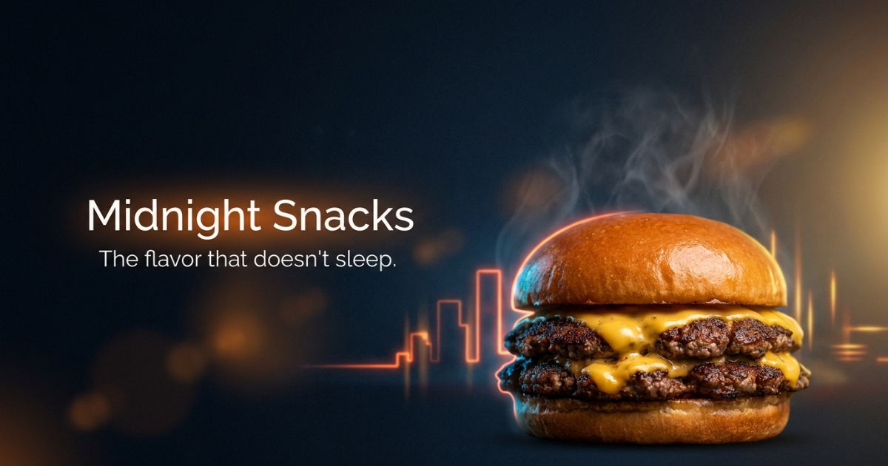

# 🌙 Midnight_Snacks

Landing page para **Midnight_Snacks**, un servicio de delivery enfocado en ofrecer una experiencia rápida, sencilla y confiable para sus clientes.

El proyecto presenta los servicios de la empresa, zonas de cobertura, especialidades, testimonios y el proceso de funcionamiento del servicio, además de facilitar el contacto directo mediante WhatsApp.

## 🚀 Tecnologías utilizadas

* **React** — Biblioteca para la construcción de interfaces.
* **TypeScript** — Tipado estático para JavaScript.
* **Vite** — Herramienta de desarrollo y compilación.
* **CSS** — Estilos y diseño responsive.
* **ESLint** — Análisis y calidad del código.

## 📁 Estructura del proyecto

```text
Midnight_Snacks/
├── public/
│   ├── cloud-moon-fill.svg
│   └── preview.png
│
├── src/
│   ├── assets/
│   │   └── Imágenes del proyecto
│   │
│   ├── components/
│   │   ├── CTASection.tsx
│   │   ├── CoverageSection.tsx
│   │   ├── FloatingWhatsApp.tsx
│   │   ├── Footer.tsx
│   │   ├── HeroSection.tsx
│   │   ├── HowItWorksSection.tsx
│   │   ├── LiveSection.tsx
│   │   ├── NavBar.tsx
│   │   ├── PrivacyPolicy.tsx
│   │   ├── SpecialtySection.tsx
│   │   └── TestimonialsSection.tsx
│   │
│   ├── App.css
│   ├── App.tsx
│   └── main.tsx
│
├── index.html
├── package.json
├── vite.config.ts
└── README.md
```

## ✨ Características

* Diseño moderno y responsive.
* Sección principal de presentación del servicio.
* Información sobre las zonas de cobertura.
* Explicación de cómo funciona el servicio.
* Presentación de especialidades.
* Testimonios de clientes.
* Sección de llamada a la acción (CTA).
* Botón flotante de contacto mediante WhatsApp.
* Navegación entre las diferentes secciones de la landing page.
* Política de privacidad.
* Adaptación para dispositivos móviles, tablets y computadoras.

## 🛠️ Instalación

Clona el repositorio:

```bash
git clone <https://github.com/devlab921-prog/Flowsync.git>
```

Ingresa al proyecto:

```bash
cd Midnight_Snacks
```

Instala las dependencias:

```bash
npm install
```

Inicia el servidor de desarrollo:

```bash
npm run dev
```

Luego abre en el navegador la URL mostrada por Vite, normalmente:

```text
http://localhost:5173
```

## 📦 Scripts disponibles

```bash
npm run dev
```

Inicia el servidor de desarrollo.

```bash
npm run build
```

Genera la versión optimizada para producción.

```bash
npm run preview
```

Permite visualizar localmente la versión de producción.

```bash
npm run lint
```

Ejecuta ESLint para verificar posibles problemas en el código.

## 🖥️ Vista previa



## 📱 Responsive Design

La landing page está diseñada para adaptarse a diferentes tamaños de pantalla:

* 💻 Desktop
* 📱 Mobile
* 📟 Tablet

## 🎯 Objetivo del proyecto

El objetivo de **Midnight_Snacks** es proporcionar una presencia web moderna para el servicio de delivery, mostrando de manera clara su propuesta de valor y facilitando que los usuarios puedan conocer el servicio y ponerse en contacto rápidamente.

## 👨‍💻 Autor

**Gino Anderson Moreno Bejarano**

Proyecto desarrollado como landing page utilizando React, TypeScript y Vite.
